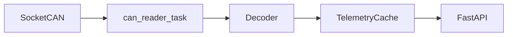

# CAN Telemetry API Service

Асинхронный сервис: чтение шины **CAN** (SocketCAN / `python-can`), обновление **in-memory кэша** телеметрии и выдача данных по **REST API** в соответствии с [doc/API-TELEMETRY-V1.md](doc/API-TELEMETRY-V1.md).

## Нормативный контекст (общественный транспорт)

- **[ITxPT](https://itxpt.org/specifications/)** — архитектура бортовых ИТ-систем, сервисы вроде **FMStoIP** для доступа к CAN-FMS по IP.
- **[(Bus) FMS-Standard](https://bus-fms-standard.com/Bus/index.htm)** / **[FMS-Standard](https://www.fms-standard.com/)** — телематический интерфейс для автобусов и коммерческого транспорта: типично **ISO 11898** @ **250 kbit/s**, прикладной уровень **SAE J1939** (PGN/SPN).
- **Канальный уровень CAN** — Bosch CAN 2.0 / **ISO 11898-1**.

Практическая расшифровка кадров в этом репозитории задаётся **подключаемым декодером** и **DBC / маппингом** в TOML (см. ниже), без жёстко зашитых PGN в ядре HTTP.

## Архитектура



- Единственный писатель кэша из шины — цикл чтения CAN; обработчики API только читают снимок.
- Пакет **`vehicle_can`** намеренно **не** называется `can`, чтобы не перекрывать модуль **`python-can`**.

## Требования

- Linux с SocketCAN (для реальной шины) или `vcan` для отладки.
- Python **3.11+** (в проекте задано **3.13** в `.python-version`).
- [uv](https://docs.astral.sh/uv/) для зависимостей.

## Установка и запуск

```bash
uv sync
uv run python src/main.py --config etc/telemetry-provider.toml
```

Для тестов и разработки без CAN установите в конфиге `DisableCan = true` (секция `[System]`).

## Конфигурация

Пример: [etc/telemetry-provider.toml](etc/telemetry-provider.toml).

| Секция | Назначение |
|--------|------------|
| `[API]` | `Host`, `HTTP_Port` (по умолчанию **7080**), `Workers` (для кэша в памяти фактически используется **1**) |
| `[System]` | `LogDir`, **`DisableCan`** |
| `[CAN]` | `Interface`, `Channel`, `Bitrate`, **`Profile`** (`bus-fms` подставляет 250000), **`Decoder`** |
| `[Cache]` | устаревание данных, число дверей, опционально throttle по PGN |
| `[Telemetry]` | **`TemperatureMode`** = `can` или `simulated` (дрейф по спецификации API) |
| `[Mapping]` | интерпретирует выбранный декодер (`dbc_path`, `signal_map`, …) |

### Декодеры (`[CAN].Decoder`)

Встроенные имена: `noop`, `bus-fms`, `dbc` (см. `vehicle_can/decoders/registry.py`). Можно указать класс по FQN: `my_pkg.decoders.foo:MyDecoder`.

Смена спецификации CAN: добавить модуль в `vehicle_can/decoders/`, зарегистрировать в реестре **или** указать FQN, поменять **`Decoder`** и при необходимости **`[Mapping]`**.

## HTTP API

См. [doc/API-TELEMETRY-V1.md](doc/API-TELEMETRY-V1.md): `GET /api/ping`, `GET /api/telemetry/v1/doors/state`, `GET /api/telemetry/v1/gear/state`, `GET /api/telemetry/v1/temperature/state`.

## Тесты

```bash
uv sync --group dev
uv run pytest -v
```
