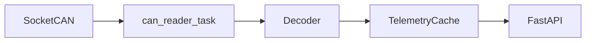

# CAN Telemetry API Service

Асинхронный сервис: чтение шины **CAN** (SocketCAN / `python-can`), обновление **in-memory кэша** телеметрии и выдача данных по **REST API** в соответствии с [doc/API-TELEMETRY-V1.md](doc/API-TELEMETRY-V1.md).

## Нормативный контекст (общественный транспорт)

- **[ITxPT](https://itxpt.org/specifications/)** — архитектура бортовых ИТ-систем, сервисы вроде **FMStoIP** для доступа к CAN-FMS по IP.
- **[(Bus) FMS-Standard](https://bus-fms-standard.com/Bus/index.htm)** / **[FMS-Standard](https://www.fms-standard.com/)** — телематический интерфейс для автобусов и коммерческого транспорта: типично **ISO 11898** @ **250 kbit/s**, прикладной уровень **SAE J1939** (PGN/SPN).
- **Канальный уровень CAN** — Bosch CAN 2.0 / **ISO 11898-1**.

Практическая расшифровка кадров в этом репозитории задаётся **подключаемым декодером** и **DBC / маппингом** в TOML (см. ниже), без жёстко зашитых PGN в ядре HTTP.

## Архитектура



- Единственный писатель кэша из шины — цикл чтения CAN; обработчики API только читают снимок.
- Пакет **`vehicle_can`** намеренно **не** называется `can`, чтобы не перекрывать модуль **`python-can`**.

## Требования

- Linux с SocketCAN (для реальной шины) или `vcan` для отладки.
- Python **3.11+** (в проекте задано **3.13** в `.python-version`).
- [uv](https://docs.astral.sh/uv/) для зависимостей.

## Установка и запуск

```bash
uv sync
uv run python src/main.py --config etc/telemetry-provider.toml
```

Для тестов и разработки без CAN установите в конфиге `DisableCan = true` (секция `[System]`).

## Docker (RK3568)

Сборка и запуск в контейнере на плате с **host network** и SocketCAN **`can0`** (интерфейс поднимает **`can0-setup.service`** на хосте; контейнер только ждёт `can0` и читает шину).

Подробности бандла для `/opt`: [docker/can-telemetry/README.md](docker/can-telemetry/README.md).

### Первичный деплой

```bash
# 1. Установить etc/logs/data на хост
sudo ./docker/can-telemetry/install-to-opt.sh

# 2. Собрать образ на плате (BuildKit отключён для старого Docker)
./docker/build-rk3568.sh

# 3. Запустить
docker compose -f docker/docker-compose.yml up -d

# 4. Отключить нативный systemd-сервис приложения (can0-setup оставить)
sudo systemctl disable --now can-telemetry.service
```

Проверка: `curl -s http://127.0.0.1:7080/api/ping`, логи: `/opt/can-telemetry/logs/can-telemetry.log`.

Конфиг на плате: `/opt/can-telemetry/etc/telemetry-provider.toml` (шаблон в репозитории: [docker/can-telemetry/etc/telemetry-provider.toml](docker/can-telemetry/etc/telemetry-provider.toml)).

## Конфигурация

Пример: [etc/telemetry-provider.toml](etc/telemetry-provider.toml).

**Полный справочник по каждому параметру, устареванию кэша, throttle и пошаговое подключение новой спецификации CAN / настройка `[Mapping]`:** [doc/CONFIGURATION.md](doc/CONFIGURATION.md).

Кратко по секциям:

| Секция | Назначение |
|--------|------------|
| `[API]` | HTTP: `Host`, `HTTP_Port` (**7080**), `Workers` (для in-memory кэша эффективно **1**) |
| `[System]` | `LogDir`, `ProgramDirectory`, **`DisableCan`** |
| `[CAN]` | SocketCAN (`Interface`, `Channel`, `Bitrate`, `FD`), **`Profile`**, **`Decoder`**, `ReceiveTimeout` |
| `[Cache]` | `StaleAfterSeconds`, двери, `CoalesceByFrame`, throttle (`MinIntervalPerPgnMs`, `ProcessEveryNFrames`) |
| `[Telemetry]` | **`TemperatureMode`**: `can` / `simulated` и параметры симуляции |
| `[Mapping]` | Данные для активного декодера (`dbc_path`, `signal_map`, …) |

### Декодеры (`[CAN].Decoder`)

Встроенные имена: `noop`, `bus-fms`, `dbc`, `t856` (см. `vehicle_can/decoders/registry.py`). Альтернатива — FQN класса: `my_pkg.decoders.foo:MyDecoder`. Подробности — в [doc/CONFIGURATION.md](doc/CONFIGURATION.md).

Для Т856 используйте `Decoder = "t856"` и секции `[Mapping.temperature]`, `[Mapping.doors]`, `[Mapping.reverse]`, `[Mapping.ids]` в `kebab-case`.  
Двери: CAN `0x18FF6527` по PDF §2.6; количество в API — `[Cache].DoorCount`.

## HTTP API

См. [doc/API-TELEMETRY-V1.md](doc/API-TELEMETRY-V1.md): `GET /api/ping`, `GET /api/telemetry/v1/doors/state`, `GET /api/telemetry/v1/gear/state`, `GET /api/telemetry/v1/temperature/state`.

## Тесты

```bash
uv sync --group dev
uv run pytest -v
```

Отдельный файл (как в NMEA): `uv run tests/test_api_endpoints.py -v` — под капотом `python -m pytest` для этого файла, в начале добавляется `src` в `PYTHONPATH`.
